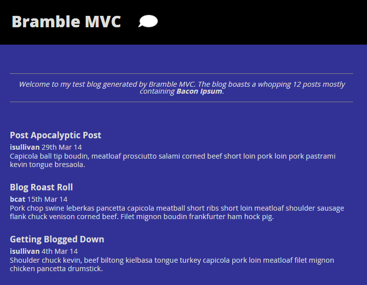

Bramble MVC Example Blog
========================
This repository contains a project that uses [Bramble MVC](https://github.com/iansullivan88/bramble-mvc) to generate a static multi-user blog site. To build the site, use `npm install` and then `node build`.



Structure
---------
View files are located in `lib/view`.
Markdown files containing markdown are stored in `lib/posts`.
Code for reading the blog posts from the file system live in `\lib\data`.
The main entry point for building the website is in `build.js`.

Routes
------
`build.js` defines various routes map urls to application logic. Here are few lines taken from `build.js`:
```js
    bramble.get('/blog/author/:name', function(req, res) {
        res.view("blogpage", {
            posts: blogRepository.getPostsByAuthor(req.parameters.name)
        });
    });

    bramble.get('/blog/post/:postName', function(req, res) {
        res.view("post", {
            post: blogRepository.getPost(req.postName)
        });
    });

    bramble.get('/more-info', function(req, res) {
        res.view("moreinfo");
    });

    bramble.redirect('/', '/blog/page');

    bramble.build(viewPath, outputDirectory, brambleBuildComplete);
```
Using the `get` method, handlers can be associated with urls and allow you to execute code prior to rendering a view. You can retrieve data from any source you like and pass it into a view for rendering. The final line tells Bramble MVC to build the site and export it to the specified output directory.

Views
-----
The rendering engine is customizable but Bramble MVC uses [Nunjucks](http://mozilla.github.io/nunjucks/) by default. Here is an excerpt from the view that renders a list of blog posts:
```html
    

    <article>
        <a href="{{ url('/blog/post/' + post.uniqueName) }}">
            <h2>{{ post.title }}</h2>
        </a>
        <section class='post-info'>
            <a href="{{ url('/blog/author/' + post.author) }}">{{ post.author }}</a>
            <time dateTime="{{ post.publishedISO8601 }}">{{ post.publishedFormatted }}</time>
            <p>{{ post.preview }}</p>
        </section>
    </article>

    
```
You get access to any properties you pass to the view from the route handler. Additionally, you get access to the `url` method. This tells what url Bramble MVC should render next. This is what makes Bramble MVC flexible. You can see that in the above example that linking to a blog file will automatically cause the author page and post page to be rendered as well - there is no configuration required, things are generated on demand!
